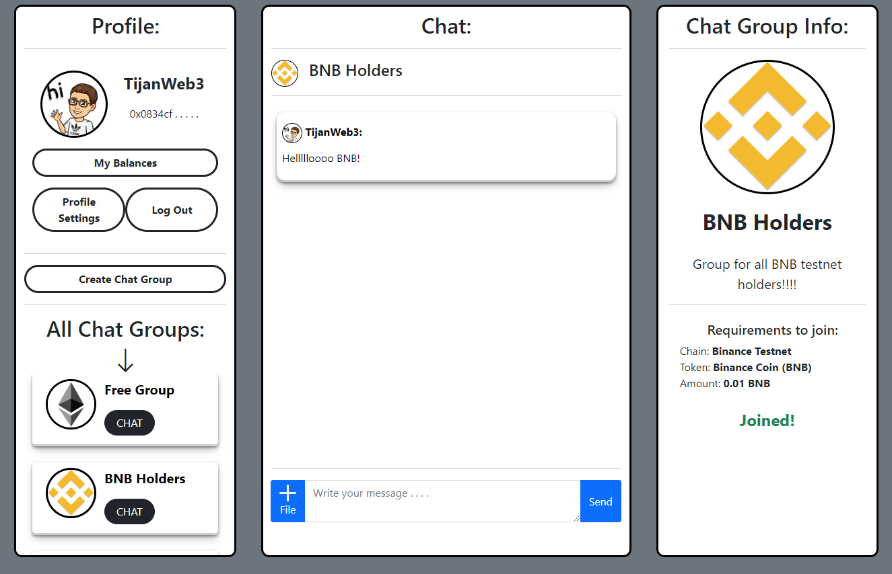

# Simple Chat
Simple Chat is decentralized application, where anyone can create a chat group with some limitations based on user's token balance or NFTs. Anyone can join any chat group as long as they meet its requirements, for example: I can create a chat group for BAYC holders and anyone holding at least 1 BAYC will be able to join and chat.

## Technologies
It was built with vanilla JavaScript.

## License
[MIT](https://choosealicense.com/licenses/mit/)
